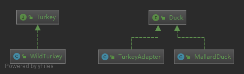

###适配器模式将一个类的接口，转换成客户期望的另一个接口。适配器让原本接口不想兼容的类可以合作无间

### 简介
####意图：
    将一个类的接口转换成客户希望的另外一个接口。适配器模式使得原本由于接口不兼容而不能一起工作的那些类可以一起工作。
####主要解决：
    主要解决在软件系统中，常常要将一些"现存的对象"放到新的环境中，而新环境要求的接口是现对象不能满足的。
####何时使用：
    1、系统需要使用现有的类，而此类的接口不符合系统的需要。 
    2、想要建立一个可以重复使用的类，用于与一些彼此之间没有太大关联的一些类，包括一些可能在将来引进的类一起工作，这些源类不一定有一致的接口。 
    3、通过接口转换，将一个类插入另一个类系中。（比如老虎和飞禽，现在多了一个飞虎，在不增加实体的需求下，增加一个适配器，在里面包容一个虎对象，实现飞的接口。）
####如何解决：
    继承或依赖（推荐）。
####优点： 
    1、可以让任何两个没有关联的类一起运行。 
    2、提高了类的复用。 
    3、增加了类的透明度。 
    4、灵活性好。
####缺点： 
    1、过多地使用适配器，会让系统非常零乱，不易整体进行把握。比如，明明看到调用的是 A 接口，其实内部被适配成了 B 接口的实现，一个系统如果太多出现这种情况，无异于一场灾难。因此如果不是很有必要，可以不使用适配器，而是直接对系统进行重构。 
    2.由于 JAVA 至多继承一个类，所以至多只能适配一个适配者类，而且目标类必须是抽象类。
####使用场景： 
    有动机地修改一个正常运行的系统的接口，这时应该考虑使用适配器模式。
### 示例中的关系图

### 额外说明
    类适配器和对象适配器的一些独特优点
    对象适配器(适配的目标是个接口 在例子中就是Duck)
        1.适配当前类的同时也能适配其子类
        2.减少了继承的使用,转而使用组合
    类适配器(适配者和被适配者都是非接口)
        1.可以不用实现要适配目标的所有方法
        
    装饰者模式与适配器模式的区分理解：
    装饰者模式(例如IO) 通常都是对原有目标动态的添加新功能(更换新算法)  
    适配器模式         转换接口
###参考地址
http://www.runoob.com/design-pattern/adapter-pattern.html

可以看看java中的Iterator

