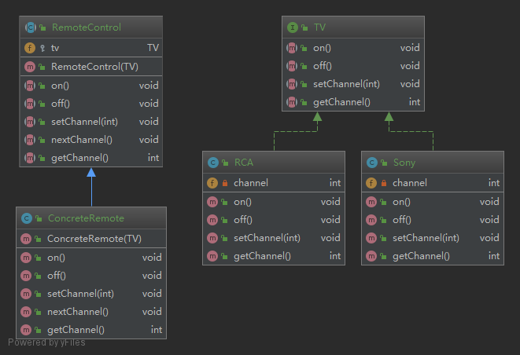

## 桥接模式不知改变你的实现,也改变你的抽象

**桥接（Bridge）是用于把抽象化与实现化解耦，使得二者可以独立变化。这种类型的设计模式属于结构型模式，它通过提供抽象化和实现化之间的桥接结构，来实现二者的解耦。**
**这种模式涉及到一个作为桥接的接口，使得实体类的功能独立于接口实现类。这两种类型的类可被结构化改变而互不影响。**

### 简介
####意图：
    将抽象部分与实现部分分离，使它们都可以独立的变化。
####主要解决：
    在有多种可能会变化的情况下，用继承会造成类爆炸问题，扩展起来不灵活。
####何时使用：
    实现系统可能有多个角度分类，每一种角度都可能变化。
####如何解决：
    把这种多角度分类分离出来，让它们独立变化，减少它们之间耦合。
####优点： 
    书上的
        1、将实现予以解耦,让它和界面之间不在永久绑定
        2、抽象和实现可以独立存在,不会影响到对方
        3、对于"具体的抽象类"所做的改变,不会影响到客户
    网上的
         1、抽象和实现的分离。 
         2、优秀的扩展能力。 
         3、实现细节对客户透明。
####缺点： 
    1、桥接模式的引入会增加系统的理解与设计难度，由于聚合关联关系建立在抽象层，要求开发者针对抽象进行设计与编程。
####使用场景： 
    1、如果一个系统需要在构件的抽象化角色和具体化角色之间增加更多的灵活性，避免在两个层次之间建立静态的继承联系，通过桥接模式可以使它们在抽象层建立一个关联关系。 
    2、对于那些不希望使用继承或因为多层次继承导致系统类的个数急剧增加的系统，桥接模式尤为适用。 
    3、一个类存在两个独立变化的维度，且这两个维度都需要进行扩展。
### 示例中的关系图

###参考地址
http://www.runoob.com/design-pattern/bridge-pattern.html