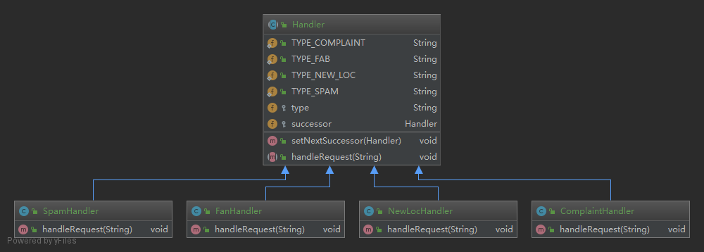

## 当你想要让一个以上的对象有机会能够处理某个请求的时候,就是用责任链模式

**责任链模式（Chain of Responsibility Pattern）为请求创建了一个接收者对象的链。这种模式给予请求的类型，对请求的发送者和接收者进行解耦。这种类型的设计模式属于行为型模式。**    
**在这种模式中，通常每个接收者都包含对另一个接收者的引用。如果一个对象不能处理该请求，那么它会把相同的请求传给下一个接收者，依此类推。**

### 简介
####意图：
    避免请求发送者与接收者耦合在一起，让多个对象都有可能接收请求，将这些对象连接成一条链，并且沿着这条链传递请求，直到有对象处理它为止。
####主要解决：
    职责链上的处理者负责处理请求，客户只需要将请求发送到职责链上即可，无须关心请求的处理细节和请求的传递，所以职责链将请求的发送者和请求的处理者解耦了。
####何时使用：
    在处理消息的时候以过滤很多道。
####如何解决：
    拦截的类都实现统一接口。
####优点： 
    1、降低耦合度。它将请求的发送者和接收者解耦。 
    2、简化了对象。使得对象不需要知道链的结构。 
    3、增强给对象指派职责的灵活性。通过改变链内的成员或者调动它们的次序，允许动态地新增或者删除责任。
    4、增加新的请求处理类很方便。
####缺点： 
    1、不能保证请求一定被接收。 
    2、系统性能将受到一定影响，而且在进行代码调试时不太方便，可能会造成循环调用。 
    3、可能不容易观察运行时的特征，有碍于除错。
####使用场景： 
    1、有多个对象可以处理同一个请求，具体哪个对象处理该请求由运行时刻自动确定。 
    2、在不明确指定接收者的情况下，向多个对象中的一个提交一个请求。 
    3、可动态指定一组对象处理请求。
### 示例中的关系图

###参考地址
http://www.runoob.com/design-pattern/chain-of-responsibility-pattern.html