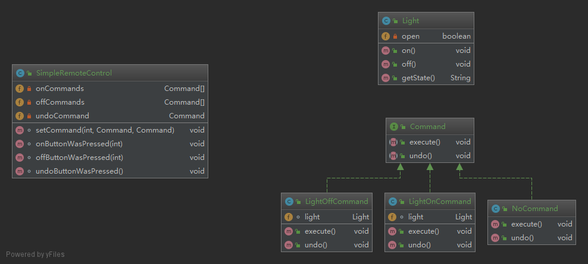

###命令模式将“请求”封装成对象，以便使用不同的请求、队列或者日志来参数化其他对象。命令模式也支持可撤销的操作。

**命令模式（Command Pattern）是一种数据驱动的设计模式，它属于行为型模式。请求以命令的形式包裹在对象中，并传给调用对象。调用对象寻找可以处理该命令的合适的对象，并把该命令传给相应的对象，该对象执行命令。**

### 简介
####意图：
    将一个请求封装成一个对象，从而使您可以用不同的请求对客户进行参数化。
####主要解决：
    在软件系统中，行为请求者与行为实现者通常是一种紧耦合的关系，但某些场合，比如需要对行为进行记录、撤销或重做、事务等处理时，这种无法抵御变化的紧耦合的设计就不太合适。
####何时使用：
    在某些场合，比如要对行为进行"记录、撤销/重做、事务"等处理，这种无法抵御变化的紧耦合是不合适的。在这种情况下，如何将"行为请求者"与"行为实现者"解耦？将一组行为抽象为对象，可以实现二者之间的松耦合。
####如何解决：
    通过调用者调用接受者执行命令，顺序：调用者→接受者→命令。
####优点： 
    1、降低了系统耦合度。 
    2、新的命令可以很容易添加到系统中去。
####缺点： 
    1、使用命令模式可能会导致某些系统有过多的具体命令类。
####使用场景： 
    认为是命令的地方都可以使用命令模式，比如： 
    1、GUI 中每一个按钮都是一条命令。 
    2、模拟 CMD。
### 示例中的关系图

### 额外说明
    在代码示例中以某种遥控设备编写的例子,使遥控端的代码尽可能的保持简单,书上的例子是每个槽可能会对接不同的服务商
###参考地址
http://www.runoob.com/design-pattern/decorator-pattern.html