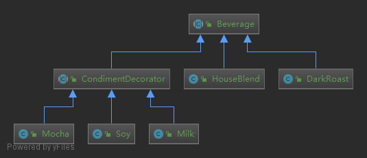

###观察者模式：当对象间存在一对多关系时，则使用观察者模式（Observer Pattern）。比如，当一个对象被修改时，则会自动通知它的依赖对象。观察者模式属于行为型模式。 

**装饰者模式:动态地将责任附加到对象上。若要扩展功能,装饰者提供了比继承更有弹性的替代方案**
>设计原则: 类应该对扩展开放，对修改关闭。

### 简介
####意图：
    动态地给一个对象添加一些额外的职责。就增加功能来说，装饰器模式相比生成子类更为灵活。
####主要解决：
    一般的，我们为了扩展一个类经常使用继承方式实现，由于继承为类引入静态特征，并且随着扩展功能的增多，子类会很膨胀。
####何时使用：
    在不想增加很多子类的情况下扩展类。
####如何解决：
    将具体功能职责划分，同时继承装饰者模式。
####优点： 
    1、装饰类和被装饰类可以独立发展，不会相互耦合，装饰模式是继承的一个替代模式，装饰模式可以动态扩展一个实现类的功能。
####缺点： 
    1、多层装饰比较复杂。
####使用场景： 
    1、扩展一个类的功能。 
    2、动态增加功能，动态撤销。
### 示例中的关系图

###参考地址
http://www.runoob.com/design-pattern/decorator-pattern.html

可参考Java的java.io
