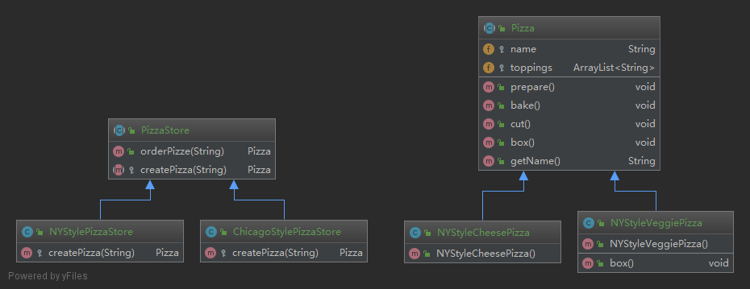
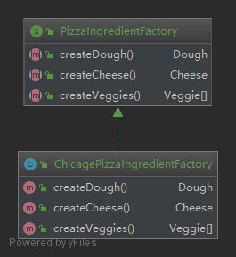

##工厂方法模式定义了一个创建对象的接口，但由子类决定要实例化的类是哪一个。工厂方法让类把实例化推迟到子类。
>设计原则(依赖倒置原则):要依赖抽象,不要依赖具体类

**工厂模式（Factory Pattern）是 Java 中最常用的设计模式之一。这种类型的设计模式属于创建型模式，它提供了一种创建对象的最佳方式。**  
**在工厂模式中，我们在创建对象时不会对客户端暴露创建逻辑，并且是通过使用一个共同的接口来指向新创建的对象。**

### 简介(工厂方法模式)
####意图：
    定义一个创建对象的接口，让其子类自己决定实例化哪一个工厂类，工厂模式使其创建过程延迟到子类进行。
####主要解决：
    主要解决接口选择的问题。
####何时使用：
    我们明确地计划不同条件下创建不同实例时。
####如何解决：
    让其子类实现工厂接口，返回的也是一个抽象的产品。
####优点： 
    1、一个调用者想创建一个对象，只要知道其名称就可以了。 
    2、扩展性高，如果想增加一个产品，只要扩展一个工厂类就可以。 
    3、屏蔽产品的具体实现，调用者只关心产品的接口。
####缺点： 
    1、每次增加一个产品时，都需要增加一个具体类和对象实现工厂，使得系统中类的个数成倍增加，在一定程度上增加了系统的复杂度，同时也增加了系统具体类的依赖。这并不是什么好事。
####使用场景： 
     1、日志记录器：记录可能记录到本地硬盘、系统事件、远程服务器等，用户可以选择记录日志到什么地方。 
     2、数据库访问，当用户不知道最后系统采用哪一类数据库，以及数据库可能有变化时。 
     3、设计一个连接服务器的框架，需要三个协议，"POP3"、"IMAP"、"HTTP"，可以把这三个作为产品类，共同实现一个接口。
### 示例中的关系图

###参考地址
http://www.runoob.com/design-pattern/factory-pattern.html

##抽象工厂模式定义了一个接口，用于创建相关或依赖对象的家族，而不需要明确指定具体类。
>设计原则(依赖倒置原则):要依赖抽象,不要依赖具体类

**抽象工厂模式（Abstract Factory Pattern）是围绕一个超级工厂创建其他工厂。该超级工厂又称为其他工厂的工厂。这种类型的设计模式属于创建型模式，它提供了一种创建对象的最佳方式。**  
**在抽象工厂模式中，接口是负责创建一个相关对象的工厂，不需要显式指定它们的类。每个生成的工厂都能按照工厂模式提供对象。**

### 简介(抽象工厂模式)
####意图：
    提供一个创建一系列相关或相互依赖对象的接口，而无需指定它们具体的类。
####主要解决：
    主要解决接口选择的问题。
####何时使用：
    系统的产品有多于一个的产品族，而系统只消费其中某一族的产品。
####如何解决：
    在一个产品族里面，定义多个产品。
####优点： 
    1、当一个产品族中的多个对象被设计成一起工作时，它能保证客户端始终只使用同一个产品族中的对象。
####缺点： 
    1、产品族扩展非常困难，要增加一个系列的某一产品，既要在抽象的 Creator 里加代码，又要在具体的里面加代码。
####使用场景： 
     1、QQ 换皮肤，一整套一起换。 
     2、生成不同操作系统的程序。
### 示例中的关系图

###参考地址
http://www.runoob.com/design-pattern/abstract-factory-pattern.html