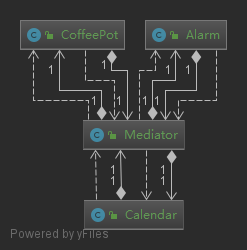

## 使用中介模式来集中相关对象之间复杂的沟通和控制方式

**中介者模式（Mediator Pattern）是用来降低多个对象和类之间的通信复杂性。这种模式提供了一个中介类，该类通常处理不同类之间的通信，并支持松耦合，使代码易于维护。中介者模式属于行为型模式。**

### 简介
#### 意图：
    用一个中介对象来封装一系列的对象交互，中介者使各对象不需要显式地相互引用，从而使其耦合松散，而且可以独立地改变它们之间的交互。
#### 主要解决：
    对象与对象之间存在大量的关联关系，这样势必会导致系统的结构变得很复杂，同时若一个对象发生改变，我们也需要跟踪与之相关联的对象，同时做出相应的处理。
#### 何时使用：
    多个类相互耦合，形成了网状结构。
#### 如何解决：
    将上述网状结构分离为星型结构。
#### 优点： 
    1、降低了类的复杂度，将一对多转化成了一对一。 
    、各个类之间的解耦。 
    3、符合迪米特原则。
#### 缺点： 
    1、中介者会庞大，变得复杂难以维护。
#### 使用场景： 
    1、系统中对象之间存在比较复杂的引用关系，导致它们之间的依赖关系结构混乱而且难以复用该对象。 
    2、想通过一个中间类来封装多个类中的行为，而又不想生成太多的子类。
### 示例中的关系图

### 参考地址
http://www.runoob.com/design-pattern/mediator-pattern.html
### 一些疑问(求解答)
    我的问题: 是否能在多个拥有完全不同行为的对象上使用中介者模式？又是具体怎么实现(一份类关系图也行..)？
    因为个人还真没遇到过正式的使用中介者模式的场合,所以无法深刻理解其含义
    文献上《Head First设计模式》写了当加入中介后类关系会有如下变化
         1.每个对象都会在自己的状态改变时,告诉中介者
         2.每个对象都会对中介者所发出的请求作出回应
    这个第一点我仍有些不明白,我参考书上使用闹钟、咖啡壶、日历的案例背景进行的理解的。
    但是我在网上看到的都有点不能给我提供帮助。(大部分都是写具有相同操作的个体与中介的关系)