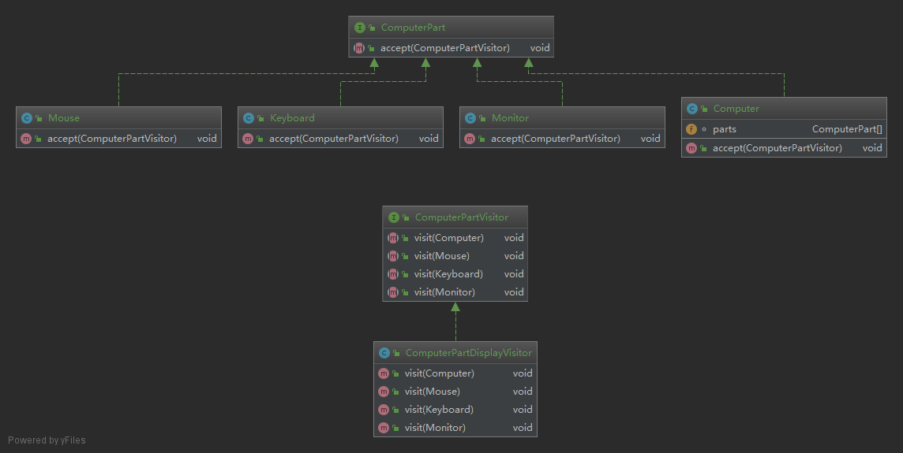

## 当你想要为一个对象的组合增加新的功能,且封装并不重要时,就是用访问者模式

**在访问者模式（Visitor Pattern）中，我们使用了一个访问者类，它改变了元素类的执行算法。通过这种方式，元素的执行算法可以随着访问者改变而改变。这种类型的设计模式属于行为型模式。根据模式，元素对象已接受访问者对象，这样访问者对象就可以处理元素对象上的操作。**  

### 简介
####意图：
    主要将数据结构与数据操作分离。
####主要解决：
    稳定的数据结构和易变的操作耦合问题。
####何时使用：
    需要对一个对象结构中的对象进行很多不同的并且不相关的操作，而需要避免让这些操作"污染"这些对象的类，使用访问者模式将这些封装到类中。
####如何解决：
    在被访问的类里面加一个对外提供接待访问者的接口。
####优点： 
    1、符合单一职责原则。 
    2、优秀的扩展性。 
    3、灵活性。
####缺点： 
    1、具体元素对访问者公布细节，违反了迪米特原则。 
    2、具体元素变更比较困难。 
    3、违反了依赖倒置原则，依赖了具体类，没有依赖抽象。
####使用场景： 
    1、对象结构中对象对应的类很少改变，但经常需要在此对象结构上定义新的操作。 
    2、需要对一个对象结构中的对象进行很多不同的并且不相关的操作，而需要避免让这些操作"污染"这些对象的类，也不希望在增加新操作时修改这些类。
### 示例中的关系图

###参考地址
http://www.runoob.com/design-pattern/visitor-pattern.html